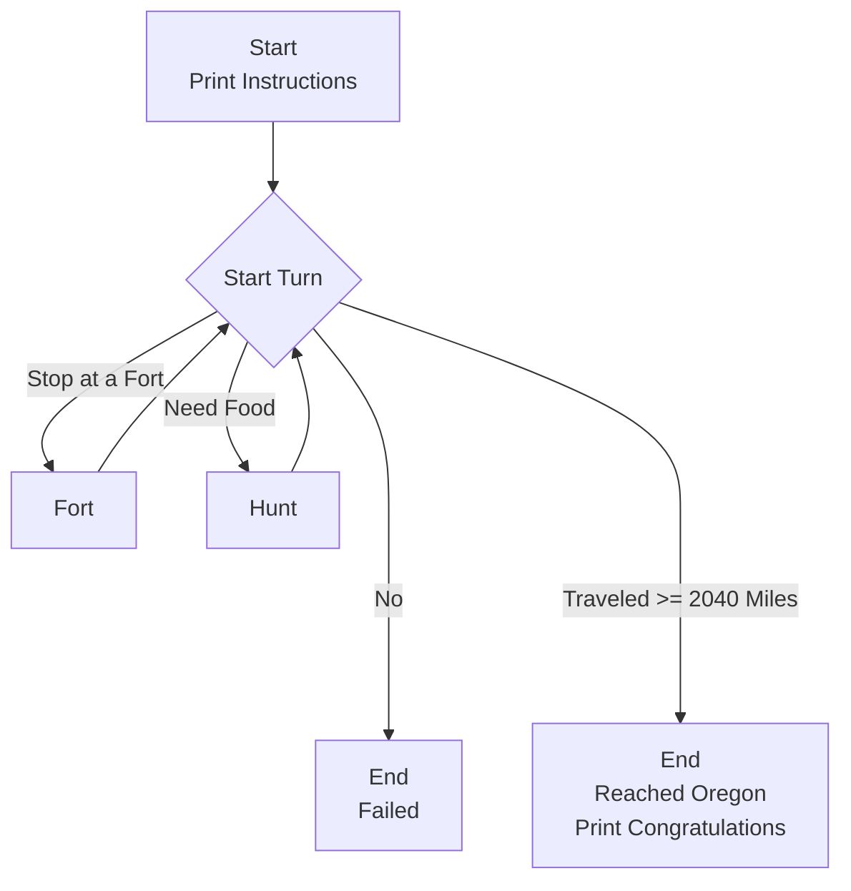

# Oregon Trail (1978 edition) in Rust

[](https://codecov.io/gh/quantifex/rust_oregontrail_1978)

## Program Flow / State Machine


## Development Environment
```shell
docker build -t oregon .
docker run -v $(pwd):/home/rust_oregontrail_1978 -it oregon
```

## Testing
```shell
cargo test

# Prepare for code coverage (included in Dockerfile)
cargo install grcov
rustup component add llvm-tools-preview
rustup toolchain install nightly

# Test w/ code coverage
export RUSTFLAGS="-Zinstrument-coverage"
cargo +nightly test
grcov . --binary-path target/debug -s . -t html --branch --ignore-not-existing --excl-start "// GCOVR_EXCL_START" --excl-stop "// GCOVR_EXCL_STOP" -o ./coverage/
```

## Build
```shell
cargo build --release
```


## Run
```shell
# Development
cargo run

# Release
target/release/rust_oregontrail_1978
```
